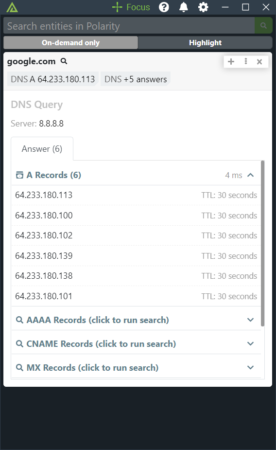

# Polarity DNS Query Integration


> This integration runs in `On Demand Only` mode

|  |  |
|:-------------------------------------------------------------:|:---------------------------------------------------------------:|:---:|
|                    *Domain Query A Record*                    |                *Domain Query MX and SOA Record*                 | *IP Query with PTR Answer*|


The Polarity DNS Query integration leverages the NodeJS Native DNS library to issue DNS queries to a specified DNS server.  The integration allows you to specify what type of query is run.  By default, the integration runs an A record query for domains and a PTR (reverse DNS) query for IP addresses.  

## DNS Query Integration Options

### DNS Server
Sets the IP address and port of the server to be used when performing DNS resolution. If the port is the IANA default DNS port (53) it can be omitted. If left blank, the Polarity Server's default DNS server will be used. Defaults to `8.8.8.8`.

### Private IPs Only

If checked, the integration will only look up private (RFC-1918) IP addresses. Domains will still be looked up unless you turn domains off via the "Data Types" settings page.

### DNS Query Types for Domains

One or more query types to run. Each selected type requires a separate query to your DNS server. If no types are selected an A Record query will be issued. Query types only apply to domains as IPs will always be a reverse lookup.

### Results Filter

Choose which results are displayed. Defaults to always showing a result. Can also be set to only show results with an Answer section, or to only show results with an Answer or Authority section.

## Troubleshooting

### Reverse DNS Lookups

In some cases you may not get results for reverse DNS lookup (including for known IP addresses such as 8.8.8.8).  This can be caused by an external DNS routing issue in your Docker container.

If you run into this issue you may need to explicitly add a `dns` entry to your `docker-compose.yml` file under the `app` section.  For example:

```yml
dns:
  - 8.8.8.8
```

## About Polarity

Polarity is a memory-augmentation platform that improves and accelerates analyst decision making.  For more information about the Polarity platform please see:

https://polarity.io/
